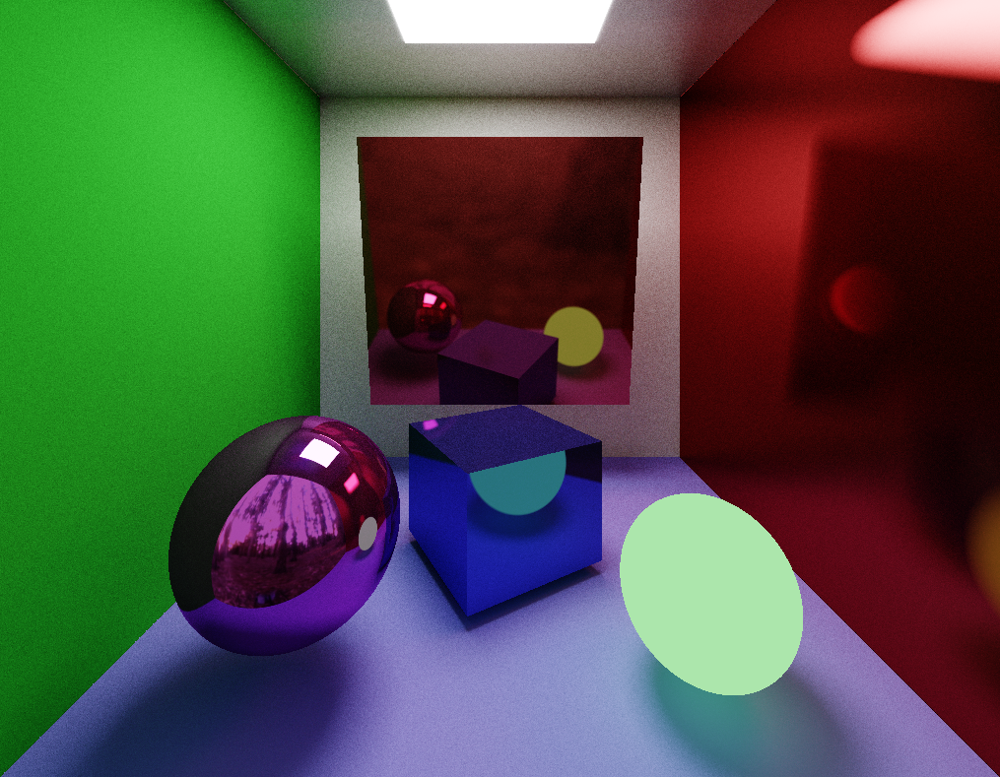

# Morra

The [Shadertoy](https://www.shadertoy.com/) website, where a lot of people share their shaders, is widely known among computer graphics enthusiasts.
There is also a great plugin [Visual Studio Code - Shader Toy](https://github.com/stevensona/shader-toy) that allows you to create and debug shaders directly in VS Code. 
This project is essentially a shader library that aims to be used with this plugin. It provides handy functions for raytracing and raymarching, distance and intersection functions with objects, noise functions etc, as well as various example shaders.

**Warning**

The project is under active development and many things are not yet implemented or done well enough.

## Gratitudes

* [Inigo Quilez](https://iquilezles.org/) - The vast majority of the functions used here can be found on the Inigo Quilez website with explanations and examples

* [Shadertoy](https://www.shadertoy.com/) - I found a lot of ideas on this site while studying shaders by far more professional people than me.

* [The blog at the bottom of the sea](https://blog.demofox.org/) - Great blog with lots of articles on computer graphics, particularly raytracing
 
## Examples

